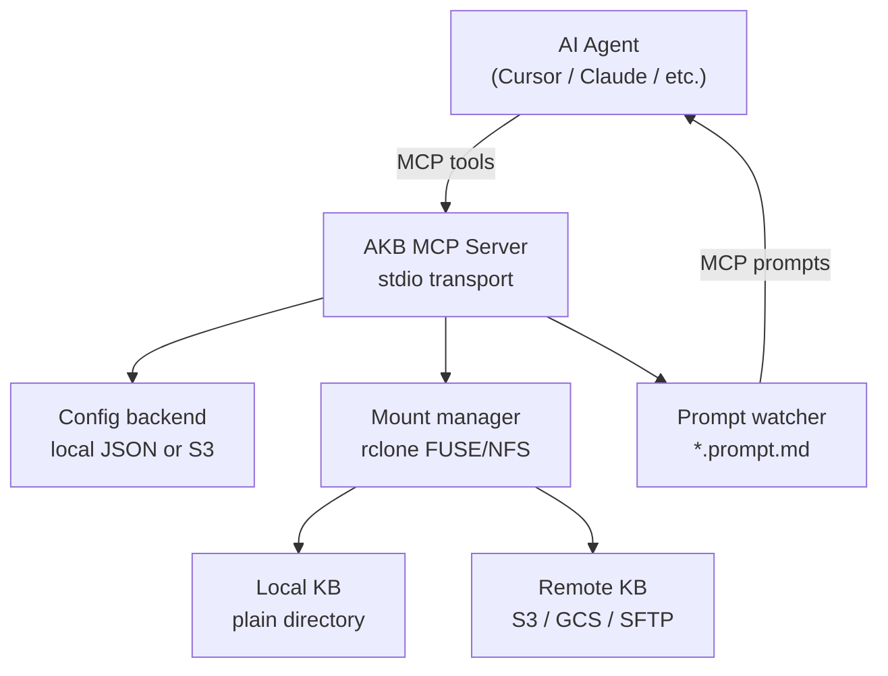

# AKB — Agentic Knowledge Base

[](https://github.com/bkosm/akb/actions/workflows/ci.yml)
[](https://go.dev/dl/)
[](LICENSE)

An MCP server that manages knowledge bases as mounted directories. AI agents interact with KBs using standard file tools (Read, Write, Glob, Grep) on local paths — remote storage is transparently mounted via [rclone](https://rclone.org/).

## Installation

### go install

```bash
go install github.com/bkosm/akb/go/akb/cmd/akb@latest
```

### Download binary

Pre-built binaries for macOS and Linux (amd64/arm64) are available on the [Releases](https://github.com/bkosm/akb/releases) page.

### From source

```bash
git clone https://github.com/bkosm/akb.git
cd akb
make build
# binary at bin/akb
```

## Configure as MCP

### Local config

- <a href="https://cursor.com/en-US/install-mcp?name=akb-s3&config=eyJlbnYiOnsiQVdTX1BST0ZJTEUiOiJzc28tcHJvZmlsZSIsIkFXU19SRUdJT04iOiJidWNrZXQtcmVnaW9uIn0sImNvbW1hbmQiOiJha2IgczMifQ%3D%3D" target="_blank"></a>
- `claude mcp add akb-local -- akb local`

### S3 config

- <a href="https://cursor.com/en-US/install-mcp?name=akb-local&config=eyJjb21tYW5kIjoiYWtiIGxvY2FsIn0%3D" target="_blank"></a>
- `claude mcp add akb-s3 -e AWS_PROFILE=profile -e AWS_REGION=eu-west-1 -- akb s3`


## Architecture



## Prerequisites

- **Go 1.25+**
- **rclone** (only needed for remote-backed KBs) — see [docs/rclone-setup.md](docs/rclone-setup.md) or install in one line:
  ```bash
  curl -fsSL https://raw.githubusercontent.com/bkosm/akb/main/bin/install-rclone.sh | bash
  ```

## KB configuration

Each KB entry in the config has these fields:

```json
{
  "rclone_remote": ":s3,provider=AWS,env_auth=true,region=eu-west-1:my-bucket/prefix/",
  "mount": "$HOME/my-repo/.akb/my-kb",
  "mount_method": "nfs",
  "rclone_args": {
    "vfs-cache-max-size": "5G",
    "read-only": ""
  },
  "description": "My knowledge base"
}
```

| Field | Required | Description |
|-------|----------|-------------|
| `mount` | yes | Local directory path. For project-scoped KBs, prefer `.akb/<name>` under the repository root (e.g. `$HOME/my-repo/.akb/my-kb`) and add `.akb` to the repo's `.gitignore`. For global KBs shared across projects, use `$HOME/.akb/mounts/<name>`. For remote KBs, omitting mount defaults to `$HOME/.akb/mounts/<name>`. |
| `rclone_remote` | no | rclone remote spec. Omit for a plain local directory. Format: `:backend,opt=val:bucket/path`. See [rclone docs](https://rclone.org/overview/#syntax-of-remote-paths). |
| `mount_method` | no | `"fuse"`, `"nfs"`, or omit for auto. |
| `rclone_args` | no | Flag overrides as `{"flag-name": "value"}` (without `--` prefix). Empty value for boolean flags. Merged on top of defaults. |
| `description` | no | Human-readable description. |

All KB config fields (`mount`, `rclone_remote`, `rclone_args`) support `$ENV_VAR` expansion at runtime. When using a remote config backend (S3), always use env var prefixes (e.g. `$HOME`) instead of bare absolute paths so configs stay portable across developers and machines. Local config backends can use absolute paths.

### Default rclone args

These are applied to every mount unless overridden via `rclone_args`:

| Flag | Default | Purpose |
|------|---------|---------|
| `vfs-cache-mode` | `full` | Full read/write caching |
| `vfs-cache-max-size` | `1G` | Max local cache size |
| `vfs-cache-max-age` | `48h` | Cache entry TTL |
| `dir-cache-time` | `30s` | Directory listing cache |
| `poll-interval` | `15s` | Remote change polling |
| `vfs-write-back` | `5s` | Delay before flushing writes to remote |
| `daemon` | *(bool)* | Run mount in background |
| `daemon-wait` | `30s` | Max time to wait for daemon startup |

## Prompts

Prompts are auto-discovered from `*.prompt.md` files in mounted KBs and registered as MCP prompts. Drop a file into any KB and it becomes available as a slash-command — no server restart required.

### File format

```markdown
---
description: Code review with project conventions
arguments:
  - name: language
    description: The programming language
    required: true
  - name: focus
    description: Specific areas to focus on
---

Review my {{.language}} code.{{if .focus}} Focus on: {{.focus}}{{end}}
```

See [examples/hello-world.prompt.md](examples/hello-world.prompt.md) for a complete example.

### Naming

The prompt name is derived from the file path relative to the KB root, minus the `.prompt.md` suffix, prefixed with the KB name:

| File path | KB name | Prompt name |
|-----------|---------|-------------|
| `lint.prompt.md` | `my-kb` | `my-kb/lint` |
| `go/review.prompt.md` | `my-kb` | `my-kb/go/review` |

### Template syntax

The body uses Go [`text/template`](https://pkg.go.dev/text/template) syntax:

- **Substitution**: `{{.language}}` inserts the argument value
- **Conditionals**: `{{if .focus}}...{{end}}` renders the block only when the argument is provided
- **Include**: `{{include "relative/path.md"}}` inlines another file

### Role delimiters

By default the entire body is a single `user` message. To create multi-message prompts, use `@role` headers (any heading level):

```markdown
## @assistant

You are a senior {{.language}} engineer.

## @user

Review the code I'm about to share.
```

## Operational notes

### Async startup mounts

KBs are mounted in a background goroutine that runs **concurrently** with the MCP server. Tools are available immediately, but remote KBs may not yet be mounted when the first request arrives. Use `use_kb` to mount explicitly if needed.

### Config backend concurrency

| Backend | Concurrent-write behaviour |
|---------|---------------------------|
| **S3** | Uses `If-Match` / ETag for optimistic locking. Conflicts return `ErrConflict` — callers should re-`Retrieve` and retry. |
| **localfs** | No locking. Last-writer-wins. Intended for single-process use. |

### Docker wrappers

`bin/akb-docker-s3.sh` and `bin/akb-docker-local.sh` run the MCP server inside a Docker container. They mount `tmp/docker/` (relative to the repo root) as a volume at `/tmp/docker` inside the container and pass `--privileged`.

**Local KBs** (no `rclone_remote`) work normally — set `mount` to `/tmp/docker/<name>` so files are accessible on the host at `tmp/docker/<name>/`.

**Limitation — remote KBs are not supported on macOS with the Docker wrappers.** Docker Desktop uses VirtioFS to share macOS paths into the Docker VM. VirtioFS-backed bind mounts are always `private` propagation, so neither FUSE nor NFS mounts started inside the container are visible from the host. Use the native binary (`bin/akb.sh`) when `rclone_remote` is needed. See [docs/rclone-setup.md](docs/rclone-setup.md) for details.

### Prompt `include` security

`{{include "path"}}` is not sandboxed — a `../` traversal can read any file the server process can access. KB prompts are treated as trusted content.

## Contributing

See [CONTRIBUTING.md](CONTRIBUTING.md) for development setup, code style, and the PR process.

## Development

See [AGENTS.md](AGENTS.md) for build commands, architecture, and code conventions.
